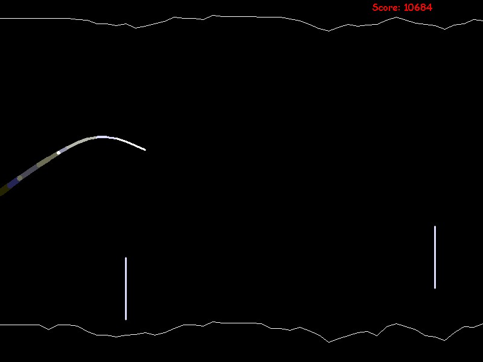



## jfCave  \*\*\*\*\* SIMPLE FUN GAME\!\!\!  \*\*\*\*\*

### Description

its a game, plain and simple. My first attempt at a real VB program. Its a sidescrolling flying game, where the object is to avoid the cliffs...simple, right?

Everybody's always asking for "original"...well I didnt find anything like this on PSC, so if you like it: PLEASE VOTE!

It uses a LOT of control arrays...probably why its so darn slow. Then again, being my first program, thats the only way I know how to draw stuff...tell me what you think (DONT FORGET TO LEAVE COMMENTS!!!)
 
### More Info
 

             |
---                |---
**Submitted On**   |2001-11-16 22:03:04
**By**             |[Emperor Frollard](https://github.com/Planet-Source-Code/PSCIndex/blob/master/ByAuthor/emperor-frollard.md)
**Level**          |Intermediate
**User Rating**    |4.9 (102 globes from 21 users)
**Compatibility**  |VB 5\.0, VB 6\.0
**Category**       |[Games](https://github.com/Planet-Source-Code/PSCIndex/blob/master/ByCategory/games__1-38.md)
**World**          |[Visual Basic](https://github.com/Planet-Source-Code/PSCIndex/blob/master/ByWorld/visual-basic.md)
**Archive File**   |[jfCave3567911172001\.zip](https://github.com/Planet-Source-Code/emperor-frollard-jfcave-simple-fun-game__1-28943/archive/master.zip)

